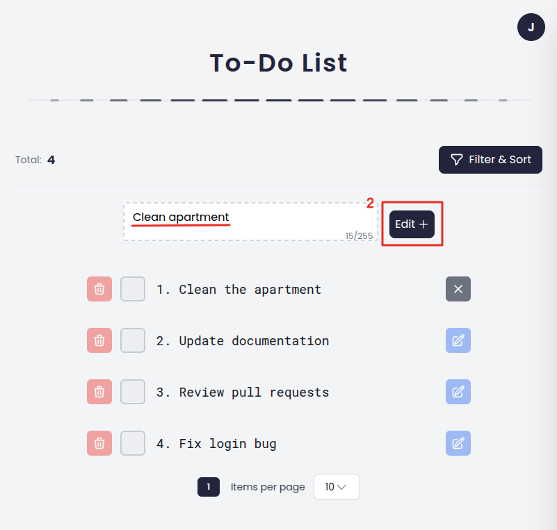
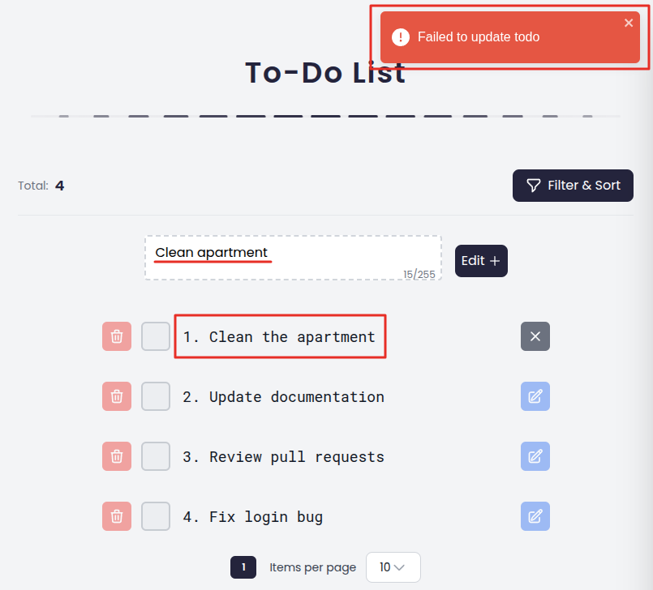

# Update Todo Functionality

This document provides a detailed explanation of how the **Update Todo** feature operates, covering both the **UI (frontend)** and **technical (backend)** aspects.

The feature is divided into two main sections:

1. **UI Flow (Frontend)**
2. **Technical Flow (Backend/Logic)**

---

## 1. Update Todo – UI Flow (Frontend)

The **Update Todo** feature enables users to modify an existing Todo item directly from the TodoList page. The process is outlined below:

### 1.1. Validation Rules

To ensure the input is valid, the following rules are enforced:

- The input must not exceed 255 characters.
- The input must not be empty.

### 1.2. Steps to Update a Todo Item

#### 1.2.1. Access the TodoList Page

- After successfully logging in, the user is redirected to the TodoList page, where all their Todo items are displayed.

#### 1.2.2. Select the Todo Item to Edit

- Locate the Todo item you wish to update. Click on the item, and its title will automatically populate the input field.
- **Example**: If you click on "Clean the apartment," the input field will display "Clean the apartment."
  <div style="max-width: 600px; margin: auto;">
    
  </div>

#### 1.2.3. Edit the Todo Item

- Modify the text in the input field as needed. When you start making changes, the "Edit" button will become active (highlighted). Once you have made the changes, click the "Edit" button to save the updates.
- **Example**: Change "Clean the apartment" to "Clean apartment," then click the "Edit" button.
  <div style="max-width: 600px; margin: auto;">
    
  </div>

#### 1.2.4. View the Result

- After clicking the "Edit" button, the system will process the update. The result will be displayed as follows:
  - **Success**: If the update is successful:
    - A notification saying "Todo updated successfully" will appear in the top-right corner.
    - The updated Todo item will remain in the same position in the list.
    - The input field will be cleared.
      <div style="max-width: 600px; margin: auto;">
        
      </div>
  - **Failure**: If the update fails (e.g., due to a validation error):
    - An error message will be displayed at the top of the page, indicating the reason for the failure.
    - The input field will retain the unsaved changes, allowing the user to make corrections and try again.
      <div style="max-width: 600px; margin: auto;">
        
      </div>

---

## 2. Update Todo – Technical Flow (Backend)

### 2.1. Overview

When the backend receives a request to update a Todo item, it follows these steps: authenticate the user, validate the request, fetch and verify the task ownership, apply the updates, save to database, and return the response.

### 2.2. API Endpoint

- **Method**: `PUT`
- **URL**: `/api/tasks/{id}`
- **Auth**: Required (JWT token)

### 2.3. Request Format

**Path Parameter:**

- `id` (integer) - Task ID to update

**Request Body:**

```json
{
  "title": "Updated task title",
  "isCompleted": true
}
```

**Validation:**

- `title`: 1-255 characters (optional)
- `isCompleted`: boolean (optional)

### 2.4. Processing Flow

#### 2.4.1. Authenticate User

- Extract user ID from JWT token
- If token is invalid → Throw `UnauthorizedAccessException`

#### 2.4.2. Validate Request

- Validate request body using `UpdateTaskDto`
- Check `title` length (1-255 characters) using `[StringLength]` attribute
- If validation fails → Return `400 Bad Request`

#### 2.4.3. Fetch Task

- Retrieve task by `id` for the authenticated user
- If task doesn't exist or doesn't belong to user → Throw `KeyNotFoundException`

#### 2.4.4. Update Task

- Update `title` if provided in request body
- Update `isCompleted` status if provided:
  - If `true` → Set `completedAt` to current UTC time
  - If `false` → Clear `completedAt` (set to null)

#### 2.4.5. Save & Respond

- Save changes to database using Entity Framework
- Return updated task as `TaskResponseDto`

### 2.5. Response

#### 2.5.1. Success (200 OK)

```json
{
  "id": 1,
  "title": "Updated task title",
  "isCompleted": true,
  "createdAt": "2023-10-01T12:00:00Z",
  "completedAt": "2023-10-02T12:00:00Z"
}
```

#### 2.5.2. Error Responses

- `400 Bad Request` - Validation failed (e.g., title too long or empty)
- `401 Unauthorized` - Invalid or missing JWT token
- `404 Not Found` - Task doesn't exist or doesn't belong to user
